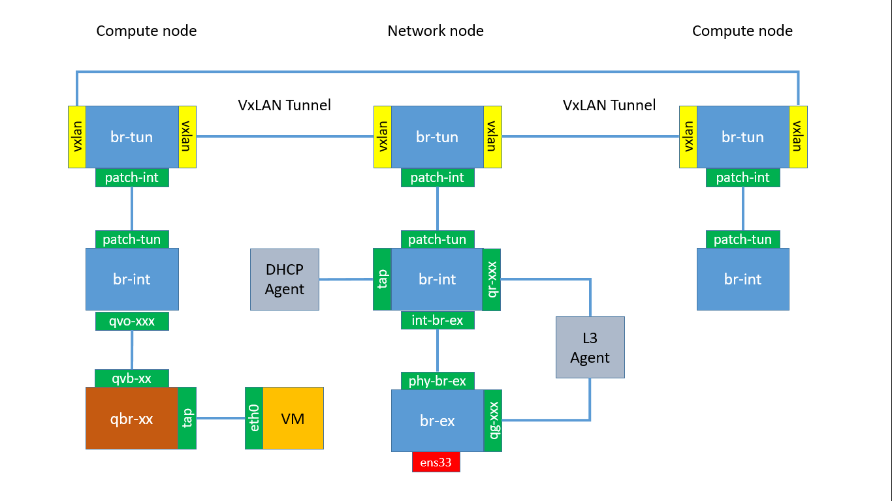

###Open vSwitch Layout
The OpenStack framework is able to use different Software Defined Storage solutions. The default option is the Open vSwitch as per ``/etc/neutron/plugin.ini`` configuration file on the Controller node. The Open vSwitch installed on the Network node and all the Compute nodes is controlled by the Neutron service via the Open vSwitch Neutron Agents wich settings are in configuration file ``/etc/neutron/plugins/ml2/openvswitch_agent.ini``.

On the Controller node
```
# vi /etc/neutron/plugin.ini
[ml2]
# (ListOpt) Ordered list of networking mechanism driver entrypoints
# to be loaded from the neutron.ml2.mechanism_drivers namespace.
# mechanism_drivers = openvswitch
mechanism_drivers = openvswitch
# Example: mechanism_drivers = openvswitch,mlnx
# Example: mechanism_drivers = arista
# Example: mechanism_drivers = openvswitch,cisco_nexus,logger
# Example: mechanism_drivers = openvswitch,brocade
# Example: mechanism_drivers = linuxbridge,brocade
```

On the Network and all Compute nodes
```
# vi /etc/neutron/plugins/ml2/openvswitch_agent.ini
[ovs]
integration_bridge = br-int
tunnel_bridge = br-tun
tunnel_types = vlan, vxlan, gre
bridge_mappings = external:br-ex
...
```

The **Integration Bridge** acts as a virtual "patch bay". On Compute node, all VM virtual interfaces are attached to this bridge and then "patched" according to their network connectivity. On the Network node, all DHCP Server instances and L3 Router, Firewall and Load Balancer are attached to this bridge.

The **Tunnel Bridge** provides the connettivity for the tenant networks between Compute nodes and Compute nodes and Network node. The tunnel type can be VLAN, VxLAN or GRE based, depending on the setup.

Finally, the **External Bridge** provides a mapping between the physical network and the Open vSwitch layout inside both Compute and Network nodes, depending on the setup. In case of Tenant networks only scenario, the Compute nodes are not attached to the external network and the external bridge is not present on the layout. The external bridge is only present on the layout of the Network node. In case of the Provider network scenario, the external bridge will be present also on the Compute nodes since it provides connectivity to the outside via the provider networks.

Making changes to the Open vSwitch Agent configuration requires always the agent restart
```
# systemctl restart neutron-openvswitch-agent
```

####Tenant network scenario
We assume a Network node providing access to the outside and two Compute nodes for VMs. We'll check both the East-West traffic between VMs belonging to the same tenant and the North-South traffic between a VM and the outside. Tenant networks connectivity is based on VxLAN tunnels.

Starting with an empty layout without VMs. Figure below shows the layout


To check the layout use ``ovs-vsctl show`` command.
```
[root@network]# ovs-vsctl show
d7930874-e155-42d7-978a-f78d0bcb218e
    Bridge br-ex
        Port phy-br-ex
            Interface phy-br-ex
                type: patch
                options: {peer=int-br-ex}
        Port br-ex
            Interface br-ex
                type: internal
        Port "ens33"
            Interface "ens33"
    Bridge br-int
        fail_mode: secure
        Port br-int
            Interface br-int
                type: internal
        Port patch-tun
            Interface patch-tun
                type: patch
                options: {peer=patch-int}
        Port int-br-ex
            Interface int-br-ex
                type: patch
                options: {peer=phy-br-ex}
    Bridge br-tun
        fail_mode: secure
        Port br-tun
            Interface br-tun
                type: internal
        Port "vxlan-c0a80120"
            Interface "vxlan-c0a80120"
                type: vxlan
                options: {df_default="true", in_key=flow, local_ip="192.168.1.38", out_key=flow, remote_ip="192.168.1.32"}
        Port "vxlan-c0a80122"
            Interface "vxlan-c0a80122"
                type: vxlan
                options: {df_default="true", in_key=flow, local_ip="192.168.1.38", out_key=flow, remote_ip="192.168.1.34"}
        Port patch-int
            Interface patch-int
                type: patch
                options: {peer=patch-tun}
    ovs_version: "2.4.0"
```

To list the bridges on the system
```
[root@network ~]# ovs-vsctl list-br
br-ex
br-int
br-tun
```

Check the chain of ports and bridges on the Network node. The bridge ``br-ex`` contains the physical network interface ``ens33`` and the virtual interface ``phy-br-ex`` attached to the ``int-br-ex`` of the ``br-int``
```
[root@network ~]# ovs-vsctl list-ports br-ex
em3
phy-br-em3
```

The integration bridge ``br-int`` is linked to the external bridge via ``int-br-ex`` interface and to the tunnel bridge via ``patch-tun`` interface
```
[root@network ~]# ovs-vsctl list-ports br-int
int-br-ex
patch-tun
```

The tunnel bridge ``br-tun`` is linked to the integration bridge via ``patch-int`` interface and to the VxLAN tunnel. The VxLAN tunnel consists in two separate ``vxlan-c0a80xxx`` interfaces. Remember that the VxLAN tunnel realize a L2 link on top of UDP/IP routed interfaces.

```
[root@network ~]# ovs-vsctl list-ports br-tun
patch-int
vxlan-c0a80120
vxlan-c0a80122
```

####Packet flow in a Tenant scenario
In this section we are going to check the packet flow when one or more instances need to communicate through the OVS layout.

Create the external network and related subnetwork
```
# source keystonerc_admin
# neutron net-create external-flat-network \
--shared \
--provider:network_type flat \
--provider:physical_network external \
--router:external True

# neutron subnet-create external-flat-network 172.120.1.0/24  \
--name external-flat-subnetwork \
--gateway 172.120.1.1 \
--disable-dhcp \
--allocation-pool start=172.120.1.200,end=172.120.1.220
```

Create a tenant network and related subnetwork
```
# source keystonerc_demo
# neutron net-create tenant-network
neutron subnet-create tenant-network 192.168.1.0/24 \
--name tenant-subnetwork \
--gateway 192.168.1.1 \
--enable-dhcp \
--dns-nameserver 8.8.8.8 \
--allocation-pool start=192.168.1.10,end=192.168.1.250
```

Create a tenant router to connect the tenant to the external network
```
# source keystonerc_demo
# neutron router-create mygateway
# neutron router-interface-add mygateway subnet=tenant-subnetwork
# neutron router-gateway-set mygateway external-flat-network
```

Start a VM on the tenant network
```
# source keystonerc_demo
# nova boot myinstance \
--flavor small \
--image cirros  \
--key_name demokey \
--security-groups default 
--nic net-id=<internal_network_id>
```

The OVS Layout should look like the following picture



1. The VM is connected to a Lunix Bridge ``qbr-xx`` via a ``tap`` interface;
2. Bridge ``qbr-xx`` is connected to ``br-int`` using virtual ethernet (veth) pair ``qvb-xx <-> qvo-xxx``;
3. Interface ``qvb-xx`` is connected to the ``qbr-xx`` linux bridge, and ``qvo-xx`` is connected to the ``br-int`` Open vSwitch (OVS) bridge.

The Linux bridge configuration can be inspected on Compute node by
```
# brctl show
bridge name     bridge id               STP enabled     interfaces
qbrbfee0484-ec          8000.e263d973999f       no      qvbbfee0484-ec
                                                        tapbfee0484-ec
```


